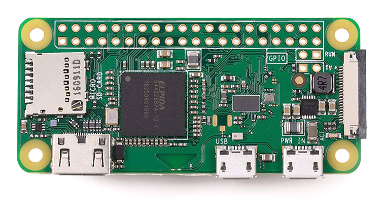
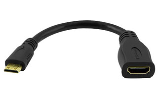

# Setting Up A Raspberry Pi

*Last Updated October 2018*

Here is how you can setup a Pi **Zero W** with Raspbian Linux to have it automatically connect to your home Wifi on its first boot up. Then it will be configured headlessly over `ssh` with commands and scripts written in this document.

This demonstration was performed with the following hardware and kernel:

**Hardware Model:** Zero W V1.1



This guide was written is using **Raspbian Stretch Lite** which is based on **Debian 9**.

**Linux Kernel:** `Linux raspberrypi 4.14.70+ #1144 Tue Sep 18 17:20:50 BST 2018 armv6l GNU/Linux`

**Workstation:** Windows 7 64-bit PC running PuTTY for ssh connection.

## Prepare a microSD card image

The micro sized SD card will be the RPi computer's "hard drive". It is non-volatile storage to boot from, install software, and save your files. The RPi is capable of about 30 MB/s maximum read and write speeds if the card is rated for it. `8 GB` is probably the most convenient size to purchase these days for a class 10 or UHS-1 rated card.

### Obtain the OS Image

[Download a Raspbian image](https://www.raspberrypi.org/downloads/raspbian/)


```
Release date: 2018-06-27
Kernel version: 4.14.50+
```

Raspbian Lite was chosen because we do not need a UI and it would be extra software taking memory and CPU cycles (and thus decrease battery runtimes).

Download the `.zip` and unzip the Raspbian `.img`.

### Flash with Etcher

There are many alternatives, but we install [etcher](https://etcher.io/) to flash the `.img` to the the card. Etcher runs on most operating systems and is simple to use. If this is the only card inserted, etcher will automatically choose it.


### Linux and Mac Alternatives to Etcher

Linux and Mac OS X do not need extra software to create a bootable SD card from an `.img`

#### Find which disk device is the SD card.

**Mac OS X**

```
diskutil list
```

**Debian-based Linux**

```
lsblk
sudo fdisk -l
blkid
ls -l /dev/sd*
sudo dmesg | tail
```

It might look something like `/dev/sdc`. Numbers at the end indicate filesystems, not the device itself. Look at the sizes of the devices. A small 8 GB one will be the SD card. The `.img` file includes file system information in it, so a `dd` command is pointed at the device.

#### Write the image to the SD card

If `/dev/disk2` (Mac) happens to be your SD card device and the image was saved in the Downloads dir or your home, then you can use this `dd` command to write it there.

**Be wary of pasting sudo AND dd commands you see on the internet! You can potentially ruin your workstation.**

```
sudo dd if=~/Downloads/2018-06-27-raspbian-stretch-lite.img of=/dev/disk2
```

### Windows Alternatives to Etcher

- Win32 USB Imager
- Rufus
- Universal USB Installer

## Headless Shortcuts

It would be more convenient to have `ssh` access from the beginning. This keeps you from having to initially buy a bunch of dongles or be hunched over a spare keyboard and monitor with no convenient way to paste commands from this procedure. Following and suceeding with this section will allow you to optionally skip the **Attaching Peripherals** section and proceed directly to **Connect Power**.

### Auto-enable ssh server

Placing an empty file named `ssh` on the `/boot` partition (top level) of the SD card is a Pi boot feature that will let the system know to enable the ssh server and allow connections for the default `pi` user.

#### Linux and Mac

After `dd` is finished, the `/boot` filesystem on the SD card will need to be mounted. If your Linux distro did not do that automatically, even after re-insertion of the SD card, then proceed with the next steps.

First create a mount point. `sudo mkdir -p /mnt/sdboot`

Mount the file system to the newly created dir. If the device was `/dev/sdc` and the boot file system is `sdc1`, then `sudo mount /dev/sdc1 /mnt/sdboot` will mount it there.

Open terminal and `cd` to the directory where the volume is mounted. From the Linux example that would be `cd /mnt/sdboot`

Mac OS X might be `cd /media/sd/boot` but it should show an icon on the desktop.

`touch ssh` to place the file there.

`-------- SCREENSHOT: TERMINAL, MOUNT, CD DIR ----------`

#### Windows

Check the drive letter of the SD card in computer.


Open command prompt with `Win+R`, type `cmd`, press enter.

If the SD card drive letter is `D` then type `d:` to jump there. My example is `i:`

Input `touch>ssh`. There may be an error message but it works. Type `dir` to check. See the screenshot.


### Wifi Pre-configure

Wifi may be setup with the `wpa_supplicant.conf` text file file in the same directory the `ssh` file was placed.

**As new as it is, RPi Zero W does not support 5GHz wifi--use an SSID on 2.4GHz.**

#### Contents of the config file

Change the `ssid` and `psk` (passkey) to your own access point while keeping the double quotes `"` wrapped around them. `WPA-PSK` is usually what most are using but it has to match your wifi network configuration to work. Country is the two-letter code. This is the actual file contents verified to work:

```
ctrl_interface=DIR=/var/run/wpa_supplicant GROUP=netdev
update_config=1
country=US

network={
    ssid="mySSID"
    psk="myWifiPassword"
    key_mgmt=WPA-PSK
}
```

It might be good to save this (without the password filled in) config file along side other local files for this project.


A USB [NIC](https://en.wikipedia.org/wiki/Network_interface_controller) that's confirmed compatible with Linux should auto-setup with [DHCP](https://en.wikipedia.org/wiki/Dynamic_Host_Configuration_Protocol) and be on the network. I did not have to do anything extra for this to succeed.


### Finding the Pi IP Address

[ARP](https://en.wikipedia.org/wiki/Address_Resolution_Protocol) your network beforehand, so you can compare the difference and see what IP gets added after the Pi has booted up. Or you can log into your router and look at the DHCP client leases table.

Windows, Linux, and Mac should all be able to run `arp -a` in the terminal or cmd. Do that now and keep the window open or copy/screenshot to a note.

#### Linux Arp Table Example

```
? (172.17.0.2) at 02:42:ac:11:00:02 [ether] on docker0
? (172.52.45.163) at 58:00:bb:a4:c4:30 [ether] on eth2
? (172.52.45.162) at 38:4f:49:9f:2a:b0 [ether] on eth2
? (172.52.45.161) at 50:87:89:a2:5a:59 [ether] on eth2
```

#### Mac OS X Arp Table Example

```
? (192.168.0.1) at b0:4e:26:55:48:66 on en9 ifscope [ethernet]
? (192.168.0.131) at (incomplete) on en9 ifscope [ethernet]
? (192.168.0.255) at ff:ff:ff:ff:ff:ff on en9 ifscope [ethernet]
? (224.0.0.251) at 1:0:5e:0:0:fb on en9 ifscope permanent [ethernet]
? (239.255.255.250) at 1:0:5e:7f:ff:fa on en9 ifscope permanent [ethernet]
```

## Optional: Attaching Peripherals

**Skip this section if you're following along with headless ssh.**

Power is connected last.

### Adding USB and Network

#### Option 1: OTG Cable

To break out the USB ports into something usable on the Pi Zero, use something like an [OTG cable](https://en.wikipedia.org/wiki/USB_On-The-Go#OTG_micro_cables), which is just the standard for *Micro USB Male-B* to *USB Female-A*. The host/client relationship does not matter to the cable. A regular USB 2.0 hub can be connected providing USB *Female-A* ports for peripherals (which almost all are *Male-A*). An externally powered hub is even better--or may even be required if your devices are high-powered (flash drives, tv tuners, wifi). A USB 3.0 hub has no performance benefit as all Pi USB Host Controllers are 2.0.


#### Option 2: Jumper a USB PCI Bracket

If you have spare parts from building computers, you can take a dual USB PCI bracket and jump the pins together using some solid wire or paper clips. Take the [0.1" female USB header](http://pinoutguide.com/Motherboard/usb_2_1_header_pinout.shtml) and connect each pair of the two rows of jacks together. This links both of the *Female-A* ports to each other. One port is for a *Micro Male-A* cable to let you connect to the Pi Zero, and the other for the *Male-A* end of a USB hub. I have verified this works. Then I ordered the OTG cable to at least have one!


#### Option 3: Solder a Spliced Micro Cable

Sacrifice a spare micro USB cable to cut open and splice its *Male-A* end into your USB hub. This needs to be done somewhat neatly or it may not work. You are breaking the shielding a normal cable would have.

Not all USB cables are alike. In the top left panel you see the right cable only has power and ground.

It might be easier than splicing cables, if you desolder the old cable or port, and solder the clipped cable directly on the hub like shown.

The modern adapters are fairly cheap and this takes some work, but you're recycling old components that maybe have not been used for years and even get thrown out today. 


### Video Output

#### HDMI

You will need a *male mini-HDMI* (Not micro) to *HDMI (either male or female)* adapter. A *female HDMI* adapter might be more convenient. It allows you to use a standard HDMI cable of a preferred length. Adding more interconnects in between the HDMI signal has a chance of not working. Do not daisy chain too many.



#### Analog Composite

There is also composite analog TV out on the Pi Zero. A two pin header can be soldered there to wire up a yellow RCA jack. Video output is not necessary with the *headless* `ssh` setup mentioned earlier.

Composite video tutorial on [modmypi.com](https://www.modmypi.com/blog/how-to-add-an-rca-tv-connector-to-a-raspberry-pi-zero)

The following can be added to the `boot.txt` file to enable monochrome composite NTSC video out.

[Boot Config Source](https://www.raspberrypi.org/documentation/configuration/config-txt/video.md)

```
# Enable NTSC
sdtv_mode=0
sdtv_aspect=1
sdtv_disable_colourburst=1
```

### Peripheral Checklist

Headless setups pre-configured with wireless do not need these dongles--only the SD card!

- microSD card flashed and inserted
- USB adapted
- USB keyboard connected
- USB NIC connected and ethernet connected to a network switch

It is ready for power!

## Connect Power

Skip over to here from setting up `boot.txt` ssh and Wifi.

An 800 - 2000 mA, 5.0 - 5.2V charger is the ideal choice for powering the setup. A computer USB port is limited to 500mA--it *works* for testing, but results may vary. As the Raspberry Pi has no power switch, power is connected last.

### Ensure to Always Shutdown Safely

Hard versus soft powering off would be pulling out the USB power versus telling Linux to initiate shutdown. The simple and safe solution is to do: `sudo shutdown now`

Unplugging power without a shutdown sequence can damage your SD card and the environment you have installed! Later in this project we will cover how to handle these concerns while being battery powered. Hint: a microcontroller talking to the Pi's GPIO. Also at the end  you will be shown how to make a backup image of all this.

## Login to the Pi

Upon first boot up it will *resize* the file system to occupy the rest of the SD card then reboot.

Wait a couple of minutes after first power on. Run `arp -a` again on your workstation computer to see what new IP has shown up. That will likely be the Pi just joining your network with its DHCP lease.


I left the window open to run arp again after the Pi booted.

Or check your router's web UI config. (Usually the 192.168.0.1 login screen from your web browser) Your router config portal should show a `raspberrypi` host and its IP under `DHCP client leases table` or some labeling to that effect.

There are also tools like `nmap` and `Angry IP Scanner` to scan your subnet. But at this point if you're not seeing any new IPs then it is probably the Pi that's unable to connect. You might need to double check the `boot.txt` with your Wifi settings or follow the steps of connecting a keyboard and monitor (section **Attach Peripherals**). The `boot.txt` file may have cleaned itself up this point if you go back to check it.

### Troubleshooting: Still No IP?

With all of the peripherals connected as per the **Attaching Peripherals** section, physically sitting at the Pi monitor you will have the login prompt:

**Login as:** `pi`

**Password:** `raspberry`

Check and see if you have an IP address. Here is an example with ethernet showing the network interface has an IP address.

`ifconfig`

```
$ ifconfig
eth0: flags=4163<UP,BROADCAST,RUNNING,MULTICAST>  mtu 1500
        inet 192.168.0.6  netmask 255.255.255.0  broadcast 192.168.0.255
        inet6 fe80::92aa:2b5d:fd0b:7deb  prefixlen 64  scopeid 0x20<link>
        ether b8:27:eb:23:9e:7b  txqueuelen 1000  (Ethernet)
        RX packets 120666  bytes 71154276 (67.8 MiB)
        RX errors 0  dropped 1  overruns 0  frame 0
        TX packets 7729  bytes 879351 (858.7 KiB)
        TX errors 0  dropped 0 overruns 0  carrier 0  collisions 0
```

If you do not see a `192.168.0.x` or a local IP assigned then just skip the following connection steps. Network connectivity is going to be used for getting updates and installing additional software. Steps to do this offline manually are out of scope for now.

### SSH Connection

**Windows** will need a terminal program which supports ssh, such as [PuTTY](https://www.chiark.greenend.org.uk/~sgtatham/putty/latest.html).

**Mac & Linux** should have ssh already available from the terminal. If not, install it. Or it is time to get a better Linux distro, such as (Mint)[https://linuxmint.com/download.php]. `sudo apt-get install ssh`

#### Linux and Mac Terminal

Open your terminal program and input `ssh pi@192.168.0.6` or whatever your IP turned out to be. `pi` is the valid user name setup by default on the stock OS image. We will get to showing how to change the user name soon.

`-------- SCREENSHOT: OPEN TERMINAL ON MAC OR UBUNTU ----------`

**Password:** `raspberry`

#### Windows with PuTTY

You can avoid the mouse even though it's a GUI program! Look at the underlined letters.

- Press `Alt+S` to radio toggle SSH
- Press `Alt+N` to activate the host name field
- Type in the IP here
- Port 22 is left alone for a fresh default Pi
- Press `Alt+O` to *open* the connection


**Login as:** `pi`

**Password:** `raspberry`

## Tips: Basic Commandline Familiarity

If you're familiar with shells/terminals and Linux then skip this section.

Be careful when pasting and running `sudo` commands from the internet. Also be careful about running foreign scripts.

Test sudo: `sudo echo hello` and get the password prompt. The password is `raspberry` (default from the image). Future `sudo` commands will not prompt for now until a time elapses. **Sudo** is *super user do*, or run things as a user with unlimited power (`root` user). This is for security and safety reasons. It is very easy to "sudo-ruin-everything" on even the fanciest Linux computer. `dd` and `rm` are some of those commands. You can always reflash your SD card and start over.

If you type something wrong you can press `Ctrl+C` instead of cruise controlling the backspace key. Or press `home` and prepend the line with `#` to comment it out and have the text still on screen to study.

The `Up Arrow key` will scroll through previous commands and the `history` command shows them listed.

`Shift+PageUp` and `Shift+PageDown` will let you scroll back through the past output. You can start typing to jump back or press `Ctrl+C`.

Exiting the session can be done with `Ctrl+D` (when on the starting tty) or inputting `exit`.

Pasting text into the terminal from your workstation's clipboard depends on the software being used.

- Mac is usually `Cmd+V` to paste, `Cmd+C` to copy.
- Linux might be `Ctrl+Shift+V` to paste, `Ctrl+Shift+C` to copy.
- Windows using PuTTY is a mouse `right-click` to paste, and selecting with the mouse automatically copies.

New lines get interpreted as a command input. The last line will not be executed when pasted until you press enter. Spaces are separators for argument lists to modify the default actions of a program.

## Customize the Linux Environment

Other guides out there say to use `sudo raspi-config` and proceed to explain how to use each menu option. That can certainly be done here instead. I prefer using a sequence that can be copy and pasted without menus and interactive prompts. If I know what I want out of the computer, then I want to be able to tell it directly. These will go in as part of the whole "cheatsheet".

### Locale Change

The Pi starts default with the`en_GB.UTF-8` locale and `UK` keyboard. Changing it for the US `en_US.UTF-8`.

```
sudo sed -i '/^#/! s/^/# /g' /etc/locale.gen && \
sudo sed -i 's/# en_US.UTF-8 UTF-8/en_US.UTF-8 UTF-8/g' /etc/locale.gen
export LANGUAGE=en_US.UTF-8
export LANG=en_US.UTF-8
export LC_MESSAGES="en_US.UTF-8"
export LC_ALL=en_US.UTF-8
sudo /usr/sbin/locale-gen en_US.UTF-8
sudo update-locale en_US.UTF-8
```

### Keyboard Layout Change

I use US 105 key. Some of the symbols you input will be wrong (pipe `|` for instance) until you change the keyboard. `ssh` can send the keyboard layout for its connected terminal so you may not notice this behavior. It is still good to have the correct options set.

```
KYBD="/etc/default/keyboard"
sudo sed -i 's/XKBMODEL=.*/XKBMODEL="pc105"/g' "$KYBD" && \
sudo sed -i 's/XKBLAYOUT=.*/XKBLAYOUT="us"/g' "$KYBD" && \
sudo sed -i 's/BACKSPACE=.*/BACKSPACE="guess"/g' "$KYBD" && \
sudo sed -i 's/XKBOPTIONS=.*/XKBOPTIONS=""/g' "$KYBD"
```

### Hostname Change

Here is a script to randomize it to `zero-1234` something. `NEWNAME` is a variable so you can change the `zero-$RANDOM` to your own hostname like `mousedroid` and the script will still work. The change is seen after relogging in--which will be done after making a new user.

```
NEWNAME=zero-$RANDOM && \
sudo sed -i "s/$HOSTNAME/$NEWNAME/" /etc/hostname
sudo sed -i "s/$HOSTNAME/$NEWNAME/" /etc/hosts
sudo hostname "$NEWNAME" && \
```

Confirm the hostname changed with executing `hostnamectl`.

### Add Your User

Removing the `pi` user will add some more security and remove the ssh warnings you are seeing. A replacement user must be created first.

I will call my user on this system `mse`.

If you hit enter through every prompt the fields are safely left empty. You will want a password to have ssh access. Also you want `sudo` privilege to be able to remove `pi` user.

```
NEWUSER="mse"
sudo adduser "$NEWUSER"
sudo usermod -aG sudo "$NEWUSER"
```

The user `mse` we made can change or set a password with `sudo passwd mse`.

**Login again:** Terminate the session with `exit`. Log back in as the new user to let you **delete** the `pi` user. This will also updates the hostname from earlier.

### Remove the pi User

If you are not using wifi and do not intend for the Pi to go back on the network after the setup is complete, you may want to keep the `pi` user and the default password so you do not have to track another set of credentials.

```
sudo userdel pi
```

Bots and crackers running scripts that search around for default Raspberry Pi's will no longer simply gain access (if there are security holes in your network). There are other easy changes like this to defend against these malicious things. An example would be to change the `ssh` port from 22 to something above 1024. That proceedure is out of scope for this write up.

### Remove MotD

I like to clean up the message of the day for login. You can look up how to add ASCII art or something here.

```
sudo rm /etc/motd
touch ~/.hushlogin
```

### Run Updates

The Pi will need to be on the network to reach out for updates. If you did not obtain an IP earlier now is the time to troubleshoot.

`sudo apt update -qq && sudo apt-get upgrade -y`

Should that fail, and you're networked, it may be that `/etc/apt/sources` stupidly has the CDROM as the only repo source. I do not think this will happen with the Raspbian images. Remove the `-qq` switches (quiet) for more output to help troubleshoot.

## Backup The Image

At this point the Pi is customized and ready to become a project. Now is a good time to do a backup copy of the SD card for a start over point or starting another Pi project.

I used Win32 Disk Imager on my Windows 7 workstation. It will work for both read and write to swap Pi disk images.

[Win32 Disk Imager](https://sourceforge.net/projects/win32diskimager/)

Linux and Mac can `dd` the SD card device to a file to do the same thing.

```
sudo dd if=/dev/disk2 of=~/pi0w_fresh_setup.img
```

# Appendices

### SD Card Space

A 4GB Class 10 or UHS-1 card is suitable.

### Memory Card Adapter

[Kingston FCR-HS4 Memory card reader](https://www.amazon.com/dp/B00VAGX6MW)

I use the Kingston FCR-HS3, which I bought in 2015 for $17. There is now a FCR-HS4 model for $17. This is probably the best memory card reader you can get. The cards I use for my camera will read and write in this 100 MB/s no problem. It is truly a USB 3.0 device. It works in 2.0 as well. I never have quirky issues or compatibility problems with it. Also it has its own micro SD slot, so you do not need SD adapters. All four slots show up as seperate drives, so you can have two micro SD cards inserted at once if you do use an adapter.

Here is an image backing up the microSD card the RPI was using. These are 16GB UHS-1 and were only $8. Worth the extra few dollars to have it perform 10x faster, even if the Pi itself will not see it.


### Pi Zero W Kit Pricing

[$14 Pi Zero WH with header soldered](https://www.adafruit.com/product/3708)
[$34.50 for the starter pack on adafruit](https://www.adafruit.com/product/3410)
[$40 for the ad blocking pi zero W no soldering!](https://www.adafruit.com/product/3973)

What do you really need?

- $10 Pi Zero W
- $3 OTG Cable
- $8 `8 GB` or `16 GB` UHS-1 or Class 10 μSD (usually they come with full size adapters)
- Micro USB cell charger (check a thrift store if you do not have one laying around)
- Double row of 0.1" header pins maybe (If not a Zero WH model)
- SD card reader if you don't have any computers with one (it's 2018--how could you!)

You can 3d print a case or get creative with Lego or something.
